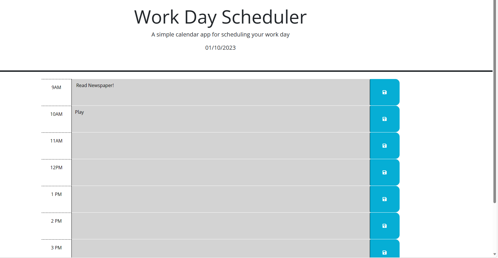
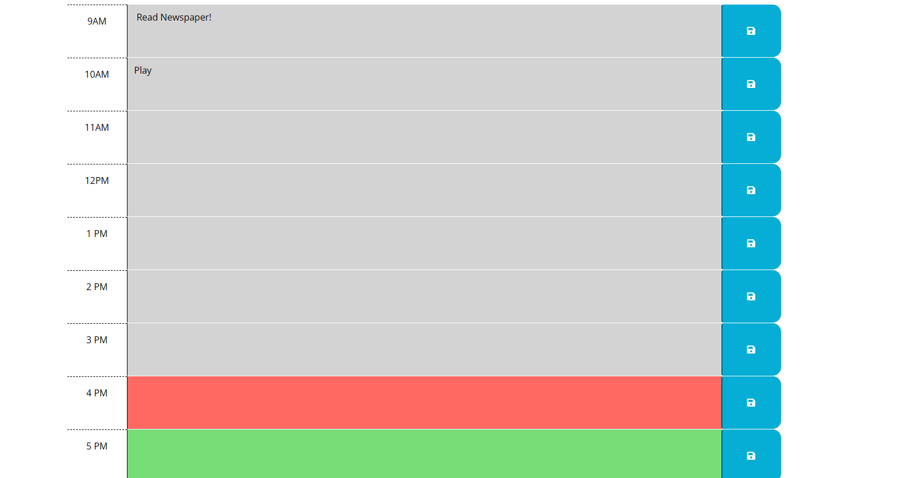
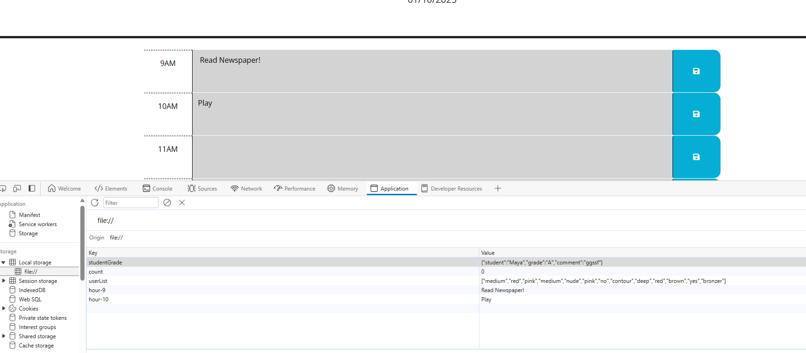

# Daily-Planner

## Description
A simple and easy-to-use daily planner for scheduling your work day. This application runs in the browser and features dynamically updated HTML and CSS powered by jQuery. It features a clean, polished, and responsive user interface.

## Technologies
* HTML
* CSS
* jQuery
* Bootstrap

#### Usage
1. Open the daily planner.
2. Scroll down to see the timeblocks for the standard business hours.
3. Click on a timeblock to enter an event.
4. Click the save button on the right of the timeblock to save the event.
5. If you refresh the page, the saved events will still be there.

## Links 

[live UrL] 

[Github] 
(https://github.com/sunainaojha/Daily-Planner/tree/main)/

## Screenshots

